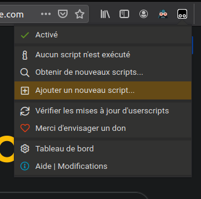
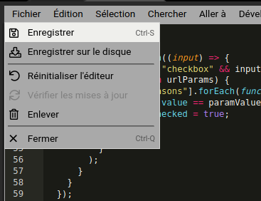

# attestation-covid-autofill tempermonkey

Ce script Tempermonkey permet de passer en parametre de l'URL les champs a remplir, reste a selectionner la raison et generer votre atestation normalement. Ce qui est proposé ici n'est en aucune facon prevu pour tricher/contourner quoi que ce soit, mais pour permettre un remplissage des donnees fixes plus rapidemment (via bookmark ou tag NFC par exemple).

exemple d'URL :

https://media.interieur.gouv.fr/deplacement-covid-19#firstname=Jean&lastname=Dupont&birthday=01/01/1970&placeofbirth=Lyon&address=999%20Avenue%20de%20France&city=Paris&zipcode=75000

## Installation

### Installation de Tempermonkey

Pour utiliser ce projet vous devrez installer le plugin Tempermonkey sur votre navigateur.

Plugin pour Firefox : https://addons.mozilla.org/en-US/firefox/addon/tampermonkey/

Plugin pour Google Chrome/Chromium : https://chrome.google.com/webstore/detail/tampermonkey

### Installation du script

Une fois le plugin installé, procédez comme suit pour installer le script :

- Cliquez sur le bouton du plugin Tempermonkey en haut à droite de votre navigateur
- Cliquez sur "Ajouter un nouvel userscript"
- Dans le nouvel onglet qui s'ouvre, copiez collez le contenu du fichier userscript.js
- Enregistrez le script en cliquant sur "Fichier" -> "Enregistrer"

# Remerciements

Je remercie [Arthur Caranta](https://github.com/acaranta/) pour le partage de son projet [acaranta/deplacement-covid-19-autofill-docker](https://github.com/acaranta/deplacement-covid-19-autofill-docker) dont je me suis inspiré pour faire ce plugin.
